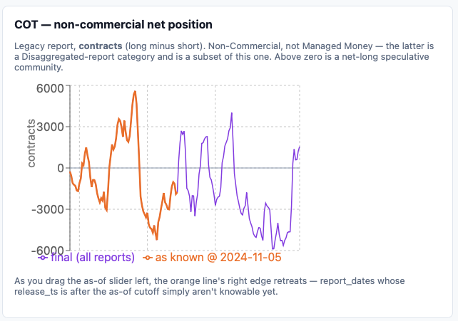

# lbr-pit

A point-in-time market data slice for lumber: CFTC positioning and FRED/ALFRED
fundamentals, each queryable as of any historical date, not just today.



## What it demonstrates

Every observation here carries two dates: the period it describes, and the
moment it became publicly knowable. Those are usually not the same date, and
the gap between them is the entire point. One generic query serves both the
COT table and the FRED/ALFRED fundamentals table:

```sql
SELECT DISTINCT ON (valid_col, series)
       valid_col, series, value
FROM   <table>
WHERE  known_col <= :as_of
ORDER  BY valid_col, series, tiebreak_col DESC;
```

`tiebreak_col` is `revision` for `cot_obs`; `fundamental_obs` has no separate
revision counter, so it reuses `known_col` (`vintage`) as its own tiebreak.
See `app/queries.py::_as_of_sql` for the concrete column names on each table.

Reading: for a given `as_of` cutoff, take the latest revision of each series
that had actually been published by that moment — anything published later
does not exist as far as the query is concerned. The dashboard's as-of slider
*is* this query, live: drag it left and any observation whose `known_col` is
after the slider date drops off the chart immediately. A backtest that reads
today's fully-revised series instead is testing a strategy that could not
have been run, because it assumes knowledge of numbers before they existed.

## Run it

**Docker (Postgres only; the app runs on the host):**

```bash
cp .env.example .env        # optionally set a real FRED_API_KEY
docker compose up -d db
export $(grep -v '^#' .env | xargs)   # load DATABASE_URL / FRED_API_KEY into the shell
```

**Local path, verified from a clean checkout** (same `.env` as above):

```bash
psql "$DATABASE_URL" -f db/schema.sql
python etl/load_futures.py && python etl/load_cot.py && python etl/load_fundamentals.py
uvicorn app.main:app --reload
cd web && npm install && npm run dev
```

UI at `:5173`; API docs at `:8000/docs`.

`FRED_API_KEY` is optional. Without one, `load_fundamentals.py` refuses to
run and the fundamentals panel shows a note instead of a chart — the term
structure, continuous price, and COT panels all work with no key at all.

## Tests

```bash
pip install -r requirements-dev.txt
docker compose up -d db && export $(grep -v '^#' .env | xargs)
psql "$DATABASE_URL" -f db/schema.sql
ruff check .
pytest -v
```

Runs against a dedicated `lbrpit_test` database, created automatically —
never against real loaded data, and never against the real CSVs. CI
(`.github/workflows/ci.yml`) runs `ruff check .` and `pytest` on every push
and pull request. **Six properties, 25 test cases** — the two as-of tests are
parametrised across a grid of cutoff dates rather than checking a single one.

Four of them need no database at all, so a reviewer can run these before starting
Docker:

```bash
pip install -r requirements-dev.txt && pytest tests/test_contract_scope.py -v
```

Each property guards a specific claim this README makes:

1. **The as-of query never returns a row published after the cutoff** — the
   point-in-time guarantee from "What it demonstrates" above, enforced as an
   executable assertion across a grid of `as_of` values, not just asserted
   by that prose. This is the one that must never go red.
2. **Revisions are honoured** — one observation, two vintages, two different
   answers, driven only by when you ask.
3. **`first_published` is the mirror, not a duplicate** — it returns the
   earliest vintage per observation, and disagrees with "as of today" on at
   least one row, or the headline chart would just be drawing the same line
   twice.
4. **Contract months order by `contract_start`, not by label** — guards
   against the exact sawtooth bug CLAUDE.md warns about: the string
   `"JAN27"` sorts before `"SEP26"`.
5. **Loaders are idempotent** — running each one twice against fixture data
   leaves row counts unchanged on the second pass. Real terminal output
   below is from a full run against the actual CSVs (not the tiny fixtures
   the test itself uses), as evidence the property holds on real data too:

   ```
   $ python etl/load_futures.py
   futures_settle: 0 -> 21 rows
   $ python etl/load_futures.py
   futures_settle: 21 -> 21 rows

   $ python etl/load_cot.py
   cot_obs: 0 -> 510 rows
   $ python etl/load_cot.py
   cot_obs: 510 -> 510 rows

   $ python etl/load_fundamentals.py
   fundamental_obs: 0 -> 29150 rows
   $ python etl/load_fundamentals.py
   fundamental_obs: 29150 -> 29150 rows
   ```

   **Two of those three totals are fixed and one is not, and the difference is the
   point of the repo.** `futures_settle` and `cot_obs` load from CSVs frozen in
   this repository, so 21 and 510 are stable for anyone who clones it.
   `fundamental_obs` loads live from ALFRED, so its total **grows as the world
   publishes** — 29,150 is what a full rebuild returned on 2026-08-10, six rows
   above the figure recorded six days earlier, because DEXCAUS is daily and
   MORTGAGE30US is weekly and neither had stopped. Expect a larger number and
   check the second line instead: **idempotency is the claim, and the second line
   is where it is made.**

6. **One contract, stated rather than assumed.** The COT source spans two CFTC
   contracts — Random Length Lumber (110,000 bf) and its replacement Lumber
   (27,500 bf) — which ran side by side for seven weeks in 2023 and **disagree on
   the sign of commercial net positioning on every one of them.** `cot_obs` is
   keyed `(report_date, series, revision)` with no contract column, so the two
   cannot coexist in it. **The loader takes Lumber from 2023-04-25**, the first
   report after the old contract was delisted, and **raises `DuplicateNaturalKey`
   on any remaining collision rather than letting `ON CONFLICT DO NOTHING` resolve
   it by discarding a row.** A series definition is a decision; it belongs in the
   loader where it can be read, not in a database rule where it cannot.

## Data sources and licences

- **CFTC Commitments of Traders** (`cot_obs`, from
  `data/cot_lumber_clean.csv`) — U.S. government data, public domain
  (CFTC.gov). **Loaded scope: the Lumber contract from 2023-04-25 onward, 170
  report dates.** The file also contains Random Length Lumber history back to
  2021; it is kept in the file and excluded at load, for the reason in point 6
  above.
- **FRED/ALFRED** (`fundamental_obs`) — pulled via the Federal Reserve Bank
  of St. Louis's FRED/ALFRED API; FRED is cited here as the retrieval
  service, not the original source of every series. `HOUST`, `HOUST1F`,
  `PERMIT`, `WPU081`, and `DEXCAUS` are public-domain government statistics.
  `MORTGAGE30US` originates with Freddie Mac's Primary Mortgage Market
  Survey and carries Freddie Mac's copyright; it is used here with
  attribution, via FRED, under FRED's terms of use.
- **CME lumber futures settlements** (`futures_settle`, from
  `data/lbr_term_structure_cme.csv`, shipped in this repo) — a static file,
  not a live feed.

## Known limitations

- **Term structure has only 3 trade dates** (`2026-07-23`, `07-27`,
  `07-29`) loaded. Deep CME historical settlement history is a paid feed;
  the loader itself is complete and idempotent, the gap is data
  availability, not code.
- **`physical_price` has a real schema and zero rows, by design.** No
  licensed physical/cash lumber feed is wired up, and none is seeded to
  fake one.
- **`continuous(roll="ltd")` is approximated.** It assumes a fixed
  last-trade day-of-month minus `n` days, because this dataset has no CME
  contract calendar. See the comment in `app/queries.py::continuous`.
- **COT `release_ts` is a documented assumption, not a sourced fact.** It
  derives "the Friday of the report week" from `report_date` rather than a
  flat `+3 days`, which fixes 2 of the 170 loaded report dates where the
  as-of date itself shifts for a holiday — but it still assumes that Friday
  release always lands at 15:30 ET, which is wrong for 6 of those 170 weeks,
  where that Friday is itself a US federal holiday. See `etl/load_cot.py` and `etl/README.md`.
